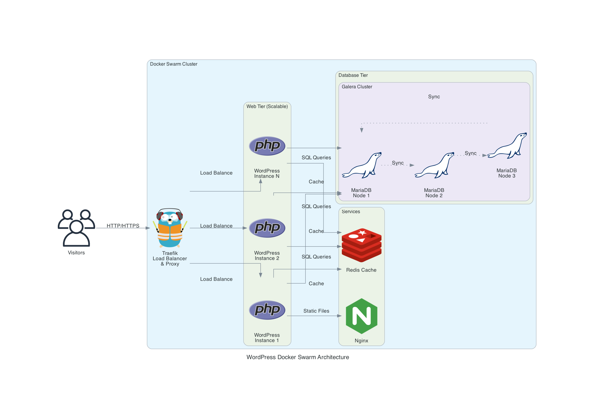

# WordPress Swarm Deployment

[](LICENSE)
[](https://www.docker.com/)

A production-ready WordPress deployment for Docker Swarm with high availability, automatic SSL, and comprehensive monitoring.

## Table of Contents

- [Overview](#overview)
- [Architecture](#architecture)
- [Prerequisites](#prerequisites)
- [Quick Start](#quick-start)
- [Configuration](#configuration)
- [Deployment](#deployment)
- [Operations](#operations)
- [Monitoring](#monitoring)
- [Troubleshooting](#troubleshooting)
- [Security](#security)
- [Contributing](#contributing)
- [License](#license)

## Overview

This project provides a complete WordPress stack optimized for Docker Swarm, featuring:

| Component | Purpose | High Availability |
|-----------|---------|-------------------|
| **Nginx** | Reverse proxy with security headers | 2+ replicas |
| **WordPress PHP-FPM** | PHP execution engine | 2+ replicas |
| **MariaDB Galera** | Synchronous multi-master database | 3 nodes |
| **Redis + Sentinel** | Object caching with failover | 3 Sentinel nodes |
| **Traefik** | SSL termination and routing | Manager node |
| **Prometheus** | Metrics and alerting | Manager node |

## Architecture



**Network topology:**
- `frontend` - Public-facing network for Traefik and Nginx
- `backend` - Internal network for database and cache (isolated from internet)
- `monitoring` - Dedicated network for metrics collection

## Prerequisites

Before deploying, ensure you have:

- **Docker Engine** 20.10.0 or later
- **Docker Swarm** initialized (`docker swarm init`)
- **Domain name** with DNS A records pointing to your server
- **Ports 80 and 443** open on your firewall

### System Requirements

| Resource | Minimum | Recommended |
|----------|---------|-------------|
| CPU | 4 cores | 8+ cores |
| RAM | 8 GB | 16+ GB |
| Storage | 50 GB SSD | 100+ GB SSD |

## Quick Start

For experienced users, deploy in four commands:

```bash
git clone https://github.com/thomasvincent/docker-wordpress-swarm-setup.git
cd docker-wordpress-swarm-setup
./scripts/setup-secrets.sh
# Edit docker-stack.yml to set your domain, then:
./scripts/galera-bootstrap.sh
```

## Configuration

### 1. Generate Secrets

Run the setup script to create secure passwords:

```bash
./scripts/setup-secrets.sh
```

This generates four secret files in `./secrets/`:
- `mysql_root_password.txt` - MariaDB root password
- `mysql_password.txt` - WordPress database password
- `redis_password.txt` - Redis authentication
- `traefik_dashboard_auth.txt` - Traefik dashboard credentials

### 2. Configure Domain

Edit `docker-stack.yml` and replace all placeholders:

| Placeholder | Replace With | Example |
|-------------|--------------|---------|
| `your-domain.com` | Your WordPress domain | `blog.example.com` |
| `traefik.your-domain.com` | Traefik dashboard subdomain | `traefik.example.com` |
| `prometheus.your-domain.com` | Prometheus subdomain | `prometheus.example.com` |
| `YOUR_REAL_EMAIL@example.com` | Email for Let's Encrypt | `admin@example.com` |

### 3. Configure DNS

Create DNS A records pointing to your server's IP:

```
blog.example.com      → <server-ip>
traefik.example.com   → <server-ip>
prometheus.example.com → <server-ip>
```

## Deployment

### Initial Deployment

The bootstrap script handles Galera cluster initialization:

```bash
./scripts/galera-bootstrap.sh
```

This script:
1. Validates Docker Swarm is active
2. Verifies all secrets exist
3. Bootstraps the first Galera node
4. Scales the cluster to 3 nodes
5. Deploys all remaining services

### Verify Deployment

Check that all services are running:

```bash
docker service ls
```

Expected output:
```
ID           NAME                    MODE        REPLICAS  IMAGE
abc123...    wordpress_wpdbcluster   replicated  3/3       mariadb:11.3
def456...    wordpress_wordpress_nginx  replicated  2/2    nginx:1.27-alpine
ghi789...    wordpress_wordpress_fpm    replicated  2/2    wordpress:6.7-php8.3-fpm
...
```

## Operations

### Scaling Services

Scale the web tier to handle increased traffic:

```bash
# Scale Nginx (reverse proxy)
docker service scale wordpress_wordpress_nginx=5

# Scale PHP-FPM (must match or exceed Nginx)
docker service scale wordpress_wordpress_fpm=5
```

> **Important:** Always scale Nginx and PHP-FPM together to prevent bottlenecks.

### Updating Images

To update to newer image versions:

1. Update the image digest in `docker-stack.yml`
2. Redeploy the stack:
   ```bash
   docker stack deploy -c docker-stack.yml wordpress
   ```

Get the latest digest:
```bash
docker pull wordpress:6.7-php8.3-fpm
docker inspect --format='{{index .RepoDigests 0}}' wordpress:6.7-php8.3-fpm
```

### Backup and Restore

**Database backup:**
```bash
docker exec $(docker ps -q -f name=wordpress_wpdbcluster | head -1) \
  mysqldump -u root -p wordpress > backup.sql
```

**WordPress content backup:**
```bash
docker run --rm -v wordpress_wp-content:/data -v $(pwd):/backup \
  alpine tar czf /backup/wp-content.tar.gz -C /data .
```

### Shutdown

Remove the stack (preserves volumes):
```bash
docker stack rm wordpress
```

Remove secrets:
```bash
docker secret rm mysql_root_password mysql_password redis_password traefik_dashboard_auth
```

## Monitoring

### Dashboards

| Dashboard | URL | Authentication |
|-----------|-----|----------------|
| Traefik | `https://traefik.your-domain.com` | Basic auth |
| Prometheus | `https://prometheus.your-domain.com` | Basic auth |

### Health Checks

All services include health checks. View health status:

```bash
docker service ps wordpress_wpdbcluster --format "table {{.Name}}\t{{.CurrentState}}"
```

### Logs

View service logs:
```bash
# All services
docker service logs wordpress_wordpress_nginx

# Follow logs in real-time
docker service logs -f wordpress_wordpress_fpm
```

## Troubleshooting

### Common Issues

<details>
<summary><strong>Services fail to start</strong></summary>

Check if secrets were created:
```bash
docker secret ls
```

If missing, run:
```bash
./scripts/setup-secrets.sh
```
</details>

<details>
<summary><strong>Galera cluster won't form</strong></summary>

Check database logs:
```bash
docker service logs wordpress_wpdbcluster
```

Force re-bootstrap (caution: may cause data loss):
```bash
./scripts/galera-bootstrap.sh --force
```
</details>

<details>
<summary><strong>SSL certificates not issued</strong></summary>

1. Verify DNS is pointing to your server
2. Check Traefik logs:
   ```bash
   docker service logs wordpress_traefik
   ```
3. Ensure ports 80/443 are accessible from the internet
</details>

<details>
<summary><strong>WordPress shows "Error establishing database connection"</strong></summary>

1. Verify Galera cluster is healthy:
   ```bash
   docker exec $(docker ps -q -f name=wordpress_wpdbcluster | head -1) \
     mysql -u root -p -e "SHOW STATUS LIKE 'wsrep_cluster_size';"
   ```
2. Check PHP-FPM can reach database:
   ```bash
   docker exec $(docker ps -q -f name=wordpress_wordpress_fpm | head -1) \
     php -r "new PDO('mysql:host=wpdbcluster;dbname=wordpress', 'wordpress', 'password');"
   ```
</details>

### Getting Help

- Check [Issues](https://github.com/thomasvincent/docker-wordpress-swarm-setup/issues) for known problems
- Review [SECURITY.md](SECURITY.md) for security-related configuration

## Security

This stack implements multiple security layers:

- **Network isolation** - Database and cache on internal-only network
- **Secret management** - Passwords stored as Docker secrets
- **HTTPS everywhere** - Automatic Let's Encrypt certificates
- **Security headers** - OWASP-recommended headers in Nginx

See [SECURITY.md](SECURITY.md) for:
- Detailed security architecture
- Vulnerability reporting process
- Pre-deployment security checklist

## Contributing

Contributions are welcome! Please:

1. Fork the repository
2. Create a feature branch (`git checkout -b feature/amazing-feature`)
3. Commit your changes (`git commit -m 'Add amazing feature'`)
4. Push to the branch (`git push origin feature/amazing-feature`)
5. Open a Pull Request

## Maintainers

- [@thomasvincent](https://github.com/thomasvincent)

## License

This project is licensed under the Apache 2.0 License. See [LICENSE](LICENSE) for details.
